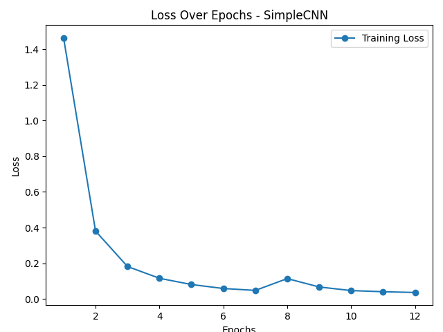
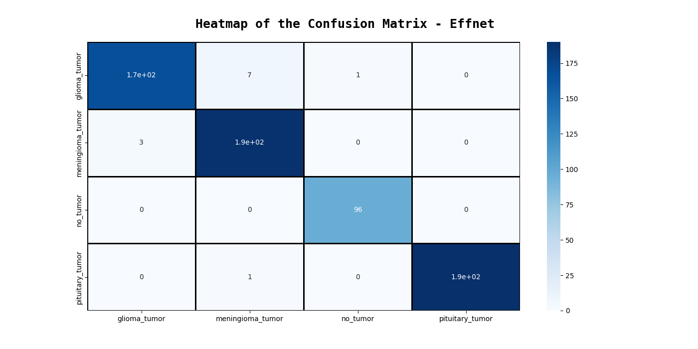

# CNNs and Transfer Learning on Brain Tumor Classification

Owen Shay

202006664

x2020gft@stfx.ca

December 21st, 2023

CSCI444: Machine Learning

# Question 1: Summary

The topic I have chosen is image classification, specifically MRI scans of various brain tumors. Brain tumors account for 85 to 90 percent of all primary central nervous system tumors, and have a 5-year survivability rate of ~34% in men and ~36% in women. Manual examinations of brain tumors can often be incorrect due to the complexities of the tumor and its properties. This is the main reason why various machine learning algorithms have been tested and implemented to this task; as accurate diagnostics is critical in the chance of survival for patients; and machine learning models can see complex relationships within the data much clearer than a human. 

The goals I have for this project are:

1. Preprocess image data from source images into a format suitable for a Convolusional Neural Network. 
2. Create a high-performing CNN of my own to test on an image classification task.
3. Compare my CNN with other CNNs.
4. Use transfer-learning to import models with pre-trained weights and test on this dataset.
5. Compare my CNN with the pre-trained models.
6. Use various analytics to visualize performance of these models through plots.

# Question 2: Dataset Description

The dataset I've chosen to use is part of the [Brain Tumor Classification Project](https://github.com/SartajBhuvaji/Brain-Tumor-Classification-Using-Deep-Learning-Algorithms/tree/master?tab=readme-ov-file#contributing-to-the-project) dataset found [here](https://github.com/sartajbhuvaji/brain-tumor-classification-dataset). Within my chosen dataset, there are 4 types of MRI scans, brains with glioma tumors, meningioma tumors, pituitary tumors and scans without tumors. Images are split into training and testing folders, and samples counts are: Glioma - 826 training and 100 testing scans, Meningioma - 822 training and 115 testing scans, Pituitary - 827 training and 74 testing scans, and No Tumor - 395 training and 105 testing scans. 

These scans come in various shapes, angles and sizes. Some are top down layer-by-layer brain MRIs, some are oriented from the sides of the skull, some from the front and back, etc. As for the intricacies of the tumors, I am unsure how to differentiate between the different types. 

The input that the CNNs will take in from preprocessing the data are 3D vector representations of these images, of form batch_size * (pixel_count x pixel_count x color_channels). in my case, I have processed the images all into 224x224px images with 3 color channels. 

# Question 3: Details

## 1. Preprocessing

In order to preprocess the data, I had to get file directories for training and testing, and iterate over the images within the class folder and reshape images so they are of homogenous sizes. Heres how I did it:

I first initialized a few variables to use:

    labels_named = [
        "glioma_tumor",
        "meningioma_tumor",
        "no_tumor",
        "pituitary_tumor",
    ]
    data = []
    labels = []

As well as setting the image size variable to 224 in order to reshape images to 224x224px. This value was chosen because the pre-trained models minimum size requirement is 224x224px.

    image_size = 224

I then used the os library to get paths to the current file and data files: 

     project_root = os.path.abspath(
        os.path.join(os.path.dirname(__file__), ".."),
    )
    data_path = os.path.join(project_root, "data")

Next I iterated through the training and testing path folders using the tqdm package and read the image data, then resized the images and appended to the arrays initialized earlier: 

    for i, label in enumerate(labels_named):
        train_folder_path = os.path.join(data_path, "Training", label)

        for image_file in tqdm_iterator(os.listdir(train_folder_path)):

            img = cv2.imread(os.path.join(train_folder_path, image_file))
            img = cv2.resize(img, (image_size, image_size))
            data.append(img)
            labels.append(i)

    for i, label in enumerate(labels_named):

        test_folder_path = os.path.join(data_path, "Testing", label)
        for image_file in tqdm_iterator(os.listdir(test_folder_path)):

            img = cv2.imread(os.path.join(test_folder_path, image_file))
            img = cv2.resize(img, (image_size, image_size))
            data.append(img)
            labels.append(i)

Then I changed the python lists to NumPy arrays as the CNNs require their input arrays to be of this format:

    data = np.array(data)
    labels = np.array(labels)

And one-hot encoded the labels to turn them from integer representations to categorical matricies:

    labels = to_categorical(labels, 4)

This produced nicely formatted arrays of the data and categorical labels for the machines to use. 

## 2. Creating my model

First, I had to initialize some final variables that would be used across all models:

    NUM_CLASSES = 4
    INPUT_SHAPE = (224, 224, 3)
    OUT_CHANNELS = 64

Then, I used Keras and it's Sequential model builder to create my model layer by layer. My first layer was the input specifications:

    Input(shape=INPUT_SHAPE)

Next was the 2D convolusion filter applied to the data, with the filter being a (3,3) kernel with 2 strides and a ReLU activation:

    Conv2D(
        OUT_CHANNELS,
        kernel_size=3,
        strides=2,
        padding="same",
        data_format="channels_last",
        activation="relu",
    )

And I also used a technique adapted from Google's Inception V1 image classifier that reduces the spatial dimensions of the data while retaining the important features using pooling, which was the MaxPooling2D layer:

    layers.MaxPooling2D(3, strides=2)

Then, the activations were normalized using Batch Normalization:

    BatchNormalization()

And then the entire process was repeated again, 2D convolusion filter applied, 2D max pooling used then normalized. 

The model was finalized by flattening the 3D input vector to 1D, then passed to the dense function to produce the final prediction with a softmax activation function:

    Flatten(),
    Dense(NUM_CLASSES, activation="softmax")

As this only serves as a blueprint for the model, the next thing to do is to compile it, which I did using the categorical crossentropy loss function and the adam optimizer: 

    model.compile(
        loss="categorical_crossentropy",
        optimizer="adam",
        metrics=["accuracy"],
    )

I created two other CNNs to compare this model to, one with more complex layers and one with less layers.

## 3. Comparing to other CNN architechtures

I began by initializing some final variables that will be used across all models:

    BATCH_SIZE = 32
    EPOCHS = 12

And I made use of callback variables, which greatly increased the performance of my models. Reduce learning rate changed the learning rate of my models across epochs in training based on the monitor, which I set to the accuracy they obtained on the validation split:

    reduce_lr = ReduceLROnPlateau(
        monitor="val_accuracy",
        factor=0.2,
        patience=2,
        min_delta=0.001,
        mode="auto",
        verbose=1,
    )

Then I stored the models within a list, as well as their names:

    models = [
        myCNN(),
        cnn(),
        cnn2(),
    ]

    model_names = [
        "MyCNN",
        "DeepCNN",
        "SimpleCNN",
    ]

In order to ensure a fair comparison, I loaded the data from preprocessing, shuffled the samples and split the data into training and testing splits with random state set so they use the same data for every iteration: 

    x_train, y_train = load_data()

    x_train, y_train = shuffle(x_train, y_train, random_state=40)

    (
        X_train,
        X_test,
        y_train,
        y_test,
    ) = train_test_split(x_train, y_train, test_size=0.2, random_state=40)

Then I put the models into an array and looped through, testing them sequentially with the same train-test parameters and callback functions:

    for i, model in enumerate(models):
        cur_model = model_names[i]

And I initialized another important callback function within the loop, called a model checkpoint. This function saves a .h5 file that contains the weights of the model at its best epoch. It is applied to the model as input weights for the following epoch and updates whenever the model outperforms the file:

    checkpoint = ModelCheckpoint(
        f"output/{cur_model}.h5",
        monitor="val_accuracy",
        save_best_only=True,
        mode="auto",
        verbose=1,
    )

Then, I trained the models with the variables set: 

    training = model.fit(
        X_train,
        y_train,
        BATCH_SIZE,
        EPOCHS,
        validation_split=0.1,
        callbacks=[checkpoint, reduce_lr],
    )

And evaluated them with two functions, evaluate and predict. evaluate returns the accuracy and predict returns the raw predictions. I required both of these for further data analysis and monitoring performance: 

    score = model.evaluate(X_test, y_test, BATCH_SIZE, verbose=True)
    pred = model.predict(X_test)

I saved the error rates, macro average of precision, recall and f1 score to a dataframe, then that dataframe to a json file.

Here are the results:

| classifier   |  MyCNN  | DeepCNN |SimpleCNN|
|:-------------|--------:|--------:|--------:|
| error              |   &#9733;0.072 |   0.116 |   0.190 |
| macro-avg precision|   &#9733;0.927 |   0.885 |   0.801 |  
| macro-avg recall   |   &#9733;0.923 |   0.877 |   0.824 |
| macro-avg f1-score |   &#9733;0.924 |   0.880 |   0.808 |

My CNN outperformed the others in every category by a wide margin. I believe this is due to parameter fine tuning. A lot of research into CNN models for image classification was done and applied to this model. 

Comparing directly to the more complex CNN, mine could've outperformed this due to dataset size; as this is a small dataset; as a more complex model is prone to overfitting. 

For the simpler model, mine most likely performed better due to the complexity of the data, as it may not have been able to capture all the small relationships between data points, as well as the fact that simple models tend to underfit on data. 

By keeping the layers complex enough to capture complex relationships in the data while keeping it simple enough to not overfit on input data, I believe I struck a good medium for this dataset.

## 4. Importing transfer-learning models 

Transfer learning can be incredibly useful in many applications, especially when there is little data to work with. This reason is why I decided to implement some models to test against my CNN.

I tested my model against three pre-trained complex models that are used in image classification. The models I chose to compete against are the EfficientNetB0 model, The MobileNetV3 small model and the MobileNetV3 large model. I retrieved these models from the keras applications API and added a few layers to them to fit with my dataset. All the weights for the models were set to imagenet, a very large database of images that these models used to pre-train.

Here's the import and initialization of EfficientNetB0:

    effnet = EfficientNetB0(
        weights="imagenet",
        include_top=False,
        input_shape=INPUT_SHAPE,
    )

    def effnetModel():
        model = effnet.output

        # global average pooling takes the average of the feature maps across spatial dimensions
        model = layers.GlobalAveragePooling2D()(model)

        # dropout helps with minimizing overfitting
        model = layers.Dropout(rate=0.5)(model)

        # added dense layer so outputs are correct for my task
        model = layers.Dense(4, activation="softmax")(model)

        # final initialization of model with new layers
        model = models.Model(inputs=effnet.input, outputs=model)

Here's the import and initialization of the small MobileNetV3:

    mobile_netSmall = MobileNetV3Small(
        INPUT_SHAPE,
        weights="imagenet",
        include_top=False,
    )

    def mobile_netV3Small():
        model = mobile_netSmall

        model = layers.GlobalAveragePooling2D()(mobile_netSmall.output)

        model = layers.Dropout(rate=0.5)(model)

        model = layers.Dense(4, activation="softmax")(model)
        
        model = models.Model(inputs=mobile_netSmall.input, outputs=model)

Finally, Here's the import and initialization of the large MobileNetV3:

    mobile_netLarge = MobileNetV3Large(
        INPUT_SHAPE,
        include_top=False,
        weights="imagenet",
    )

    def mobile_netV3Large():
        model = mobile_netLarge
  
        model = layers.GlobalAveragePooling2D()(mobile_netLarge.output)

        model = layers.Dropout(rate=0.5)(model)
    
        model = layers.Dense(4, activation="softmax")(model)

        model = models.Model(inputs=mobile_netLarge.input, outputs=model)

All models used had the same compilation parameters: 

    model.compile(
        loss="categorical_crossentropy",
        optimizer="adam",
        metrics=["accuracy"],
    )

These models had access to a massive database of images to pre-train on, so they should outperform my CNN models based on the fact that the dataset is very small in comparison.

## 5. Comparison between my model and the transfer learning models

The models were added to the same array, used the same data splits and callback functions, and put through the train-test loop exactly like the ones in 3. Their performances were saved to the dataframe and json after training and testing. 

Here are the results along with my models:

| classifier   |  MyCNN  | DeepCNN |SimpleCNN|  Effnet |MNetSmall|MNetLarge|
|:-------------|--------:|--------:|--------:|--------:|--------:|--------:|
| error              |   0.072 |   0.116 |   0.190 |&#9733;0.018 |0.178 |   0.118 |
| macro-avg precision|   0.927 |   0.885 |   0.801 |&#9733;0.983 |0.867 |   0.897 |  
| macro-avg recall   |   0.923 |   0.877 |   0.824 |&#9733;0.983 |0.834 |   0.896 |
| macro-avg f1-score |   0.924 |   0.880 |   0.808 |&#9733;0.982 |0.826 |   0.885 |

Effnet proves to be the best model for this task, scoring an accuracy of ~98.2%. This is due to the model being pre-trained on imagenet, as well as it being created for the purpose of image classification. 

The small and large MobileNetV3 models were outperformed by my CNN as well as the more complex CNN, but their main purpose is object detection within images. This still surprised me as they are known to have decent results on image classification as well as the fact that they have the entire imagenet database pre-trained within them, but I suppose this makes sense as my models are tuned to classification.

## 6. Visualization of performance

I've made various plots to show different performance metrics. 

Here are plots for the accuracy of the models changing over the 12 epochs:

These show the improvements in prediction accuracy and validation accuracy over the iterations of epochs.

Here are the plots for loss of the models changing over the 12 epochs:

These show the improvements in loss reduction over the iterations of epochs.

Here are the recall, precision and f1 scores for each model for each class:

These show how well the models are performing within the context of each class. High precision means that when the model predicts a positive class, it is likely to be correct. It is a measure of the model's ability to avoid false positives. High recall indicates that the model is effective at capturing most of the positive instances. It is a measure of the model's ability to avoid false negatives. F1 score is the harmonic mean of precision and recall, andranges from 0 to 1, where 1 indicates perfect precision and recall.

F1 score is the most important in this task, as false positives could be very detrimental to the patients health, and capturing all the positive instances within the class is very important as missing an instance means that the patient does have a cancerous tumor (other than with the no tumor class) and it would go untreated, which ensures death. 

Here are the heatmaps of the class predictions:

These represent the true classes compared to the predicted classes. This visualization helps you find what classes are causing issues, as well as which classes your model is strongest at predicting.

From analyzing these heatmaps, it appears that all models had the most trouble with discearning between glioma and meningioma tumors. After looking at a few of the samples from each class, I can understand the confusion as there are not many differences between the two (at least to my untrained eye).
